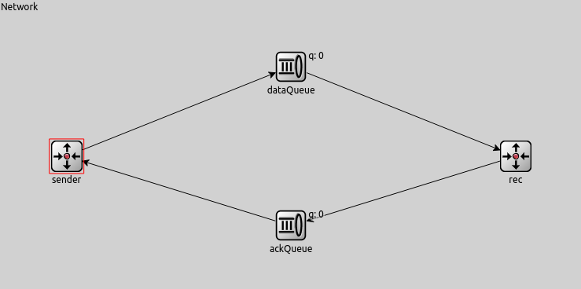

# Control de Congestión y Flujo en la Capa de Transporte con OMNET++

Informe de la tarea de análisis del laboratorio 3 de Redes y Sistemas Distribuidos - Primer cuatrimestre, FAMaF 2022.

---

**[ENUNCIADO](../Markdown/Assignment.md) | [README](../README.md) | [DISEÑO](../Markdown/Design.md)**

---

## Contenido

- [Abstract](#abstract)
- [Análisis de la red sin control de congestión ni flujo](#análisis-de-la-red-sin-control-de-congestión-ni-flujo)
  - [Introducción a la red básica](#introducción-a-la-red-básica)
  - [Introducción a la red con TLCP](#introducción-a-la-red-con-tlcp)
  - [Presentación del Caso I](#presentación-del-caso-i)
  - [Presentación del Caso II](#presentación-del-caso-ii)
  - [Análisis del Caso I](#análisis-del-caso-i)
    - [Hipótesis](#hipótesis)
    - [Mediciones](#mediciones)
    - [Análisis](#análisis)
  - [Análisis Caso II](#análisis-caso-ii)
    - [Hipótesis](#hipótesis-1)
    - [Mediciones](#mediciones-1)
    - [Análisis Caso II](#análisis-caso-ii-1)
  - [Conclusión parcial](#conclusión-parcial)
- [Análisis de la red con *TLCP*](#análisis-de-la-red-con-tlcp)
  - [Pantallazo a *Transport Limited Control Protocol*](#pantallazo-a-transport-limited-control-protocol)
  - [**TLCP Caso I**](#tlcp-caso-i)
    - [Hipótesis](#hipótesis-2)
    - [Mediciones](#mediciones-2)
    - [Análisis](#análisis-1)
  - [**Caso II**](#caso-ii)
    - [Hipótesis](#hipótesis-3)
    - [Mediciones](#mediciones)
    - [Análisis TLCP Caso II](#análisis-tlcp-caso-ii)
  - [Comparación con la red previa](#comparación-con-la-red-previa)
    - [**¿Cómo creen que se comporta su algoritmo de control de flujo y congestión?**](#cómo-creen-que-se-comporta-su-algoritmo-de-control-de-flujo-y-congestión)
    - [**¿Funciona para el caso de estudio I y II por igual? ¿Por qué?**](#funciona-para-el-caso-de-estudio-i-y-ii-por-igual-por-qué)
- [Conclusión](#conclusión)
- [Mejoras posibles](#mejoras-posibles)
- [Referencias](#referencias)

# Abstract

En este laboratorio se estudió el comportamiento de las redes frente a problemas de congestión y flujo con la herramienta de simulación por eventos discretos *OMNETT++*. Se tomó una red simplificada y se hizo un análisis sobre un escenario con problemas por congestión, otro por problemas de flujo, y luego se estudió la efectividad en ambos casos de nuestra implementación de control de ambos problemas.

# Análisis de la red sin control de congestión ni flujo

## Introducción a la red básica

La red simplificada tiene un `sender` y un `receiver`, y un nodo intermedio `queue` que simboliza la subred entre el transmisor y receptor.


- El **emisor** genera paquetes de *12500 bytes* bajo una distribucción exponencial centrada en un tiempo **`T`** (s) y tanto la `queue` intermedia como el receptor tienen un buffer interno para manejar paquetes entrantes.

- El **receptor** tiene un *datarate* interno para su `Sink`. El Sink modela lo que sería la capa de aplicación del lado del receptor, y este datarate existe para simular problemas de flujo propios del receptor.

Por razones de conveniencia con respecto a la segunda parte de este análisis, se modificó la simulación original en los siguientes aspectos:

 * El tamaño del buffer del nodo intermedio `queue` se cambio de **200** a **100** paquetes.
    > Esto para facilitar las mediciones del control de congestión.
 * El largo de la simulación se aumentó de **200 segundos** a **300 segundos**
    > Esto para normalizar aun más los datos estadísticos provenientes de la generación azarosa de paquetes.

## Introducción a la red con TLCP

La implementación de nuestro algoritmo requiere un canal de vuelta entre el receptor y emisor, por lo que se agregó ese canal con las mismas características (`datarate` y `delay`) del **nodo intermedio**. También en cada caso los parámetros de los enlaces de envío al receptor son los mismos que en la red básica para que sus mediciones sean comparables.



## Presentación del Caso I

| Conexión                           | Datarase      |
| ---------------------------------- | ------------- |
| entre `TransRx` y `RecAppLayer`    | **`0.5Mbps`** |
| entre `emisor` y `nodo intermedio` | **`1.0Mbps`** |

## Presentación del Caso II

| Conexión                           | Datarase      |
| ---------------------------------- | ------------- |
| entre `TransRx` y `RecAppLayer`    | **`1.0Mbps`** |
| entre `emisor` y `nodo intermedio` | **`0.5Mbps`** |

---
> `TransRx` : Capa de transporte del Receptor
>
> `RecAppLayer`: Capa de aplicación del receptor
---

## Análisis del Caso I

### Hipótesis

Con esos datos podemos ver a simple vista que existe un **cuello de botella** entre las dos capas de aplicación que se encuentra en el receptor mismo.

El *receptor* va a recibir mensajes más rápidos de lo que puede procesarlos, eventualmente generando **droppeos** de paquetes.

Esto es un ejemplo de problemas de *flujo*.

### Mediciones

Primero se tomó un intervalo de generación relativamente grande (**`T = 2s`**). Si bien el análisis teórico del problema dice que el receptor tiene un problema de flujo, si se ocupa poco la red no debería haber pédida de paquetes o una mínima pérdida.

Caso I tabla

| Itv      | Gen      | Del      | Drop Q | Drop R   | AvDel [s] |
|----------|----------|----------|--------|----------|-----------|
| **2.0**  | **144**  | **144**  | **0**  | **0**    | **0.40**  |
| 0.8      | 367      | 367      | 0      | 0        | 0.43      |
| 0.4      | 754      | 754      | 0      | 0        | 0.49      |
| 0.3      | 989      | 989      | 0      | 0        | 0.58      |
| 0.25     | 1190     | 1187     | 0      | 0        | 0.72      |
| 0.23     | 1280     | 1279     | 0      | 0        | 0.94      |
| 0.22     | 1344     | 1344     | 0      | 0        | 1.11      |
| 0.21     | 1418     | 1401     | 0      | 0        | 1.49      |
| 0.2      | 1494     | 1469     | 0      | 0        | 2.41      |
| **0.18** | **1664** | **1494** | **0**  | **0**    | **14.52** |
| 0.175    | 1710     | 1496     | 0      | 15       | 18.07     |
| 0.17     | 1763     | 1497     | 0      | 65       | 21.54     |
| 0.16     | 1867     | 1497     | 0      | 166      | 26.45     |
| 0.15     | 1979     | 1498     | 0      | 278      | 29.16     |
| 0.14     | 2136     | 1498     | 0      | 438      | 30.99     |
| **0.1**  | **2933** | **1498** | **0**  | **1231** | **35.83** |

> **Referencia**
>
> *Itv:* Intervalo de Generación
>
> *Gen:* Paquetes Generados
>
> *Del:* Paquetes entregados
>
> *Drop:* Paquetes perdidos **en la cola intermedia**
>
> *AvDel:* Retraso de entrega promedio

### Análisis de los resultados Caso I

* Se puede notar que hasta el rango de aproximadamente 0.25 de intervalo la red no tiene ningún tipo de retraso. Las colas están prácticamente todo el tiempo vacías
* Luego de eso hasta el rango 0.18 las colas comienzan a llenarse pero todavía no se pierden paquetes. El problema comienza a vislumbrarse, lo cual se manifiesta en que retraso promedio que suba en 2 órdenes de magnitud (de 0.4 -> 14.52).
* De ahí en más aumentar la generación de paquetes finalmente genera la pérdida de los mismos y no solamente un aumento del retraso.
* Se puede notar que la carga efectiva que de ahi en más el receptor puede recibir es de `1498` y se mantiene ahí.

Con estos datos, se realizaron los siguientes gráficos:

**Invervalo de generación de paquetes = 0.1s**


- Total de paquetes generados y almacenados en el buffer del emisor: `2933` (`293.3 Mb`)
- Total de paquetes recibidos y almacenados en el buffer de la subred: `1498` (`149.8 Mb`)
- Total de paquetes recibidos y almacenados en el buffer del receptor: `1498` (`149.8 Mb`)


**Invervalo de generación de paquetes = 0.18s**


- Total de paquetes generados y almacenados en el buffer del emisor: `1664` (`166.4. Mb`)
- Total de paquetes recibidos y almacenados en el buffer de la subred: `1494` (`149.4 Mb`)
- Total de paquetes recibidos y almacenados en el buffer del receptor: `1494` (`149.4 Mb`)


**Invervalo de generación de paquetes = 2.0s**


- Total de paquetes generados y almacenados en el buffer del emisor: `144` (`14.4 Mb`)
- Total de paquetes recibidos y almacenados en el buffer de la subred: `144` (`14.4 Mb`)
- Total de paquetes recibidos y almacenados en el buffer del receptor: `144` (`14.4 Mb`)


---

## Análisis del Caso II

### Hipótesis

En este caso se percibe que la velocidad de generación es más rápida que la velocidad de las cola en recibir y enviar al paquete al sink.

De esta manera la cola paulativamente se llenará y empezará a dropear paquetes.

Este es un claro problema de congestión, la interred no puede manejar la velocidad del generador y al no haber caminos alternativos siempre habrá problemas de congestión.

### Mediciones

Caso II tabla

| Itv      | Gen      | Del      | Drop Q   | Drop R | AvDel [s] |
|----------|----------|----------|----------|--------|-----------|
| **2.0**  | **144**  | **144**  | **0**    | **0**  | **0.40**  |
| 0.8      | 367      | 367      | 0        | 0      | 0.43      |
| 0.4      | 754      | 754      | 0        | 0      | 0.49      |
| 0.3      | 989      | 989      | 0        | 0      | 0.58      |
| 0.25     | 1190     | 1187     | 0        | 0      | 0.72      |
| 0.23     | 1280     | 1279     | 0        | 0      | 0.94      |
| 0.22     | 1344     | 1334     | 0        | 0      | 1.11      |
| 0.21     | 1418     | 1401     | 0        | 0      | 1.49      |
| 0.2      | 1494     | 1469     | 0        | 0      | 2.41      |
| **0.18** | **1664** | **1494** | **67**   | **0**  | **13.25** |
| 0.175    | 1710     | 1496     | 115      | 0      | 14.41     |
| 0.17     | 1763     | 1497     | 165      | 0      | 15.25     |
| 0.16     | 1867     | 1497     | 266      | 0      | 16.59     |
| 0.15     | 1979     | 1498     | 379      | 0      | 17.40     |
| 0.14     | 2136     | 1498     | 538      | 0      | 17.96     |
| **0.1**  | **2933** | **1498** | **1332** | **0**  | **19.98** |

### Análisis de los resultados Caso II

**Invervalo de generación de paquetes = 0.1s**


- Total de paquetes generados y almacenados en el buffer del emisor: `2933` (`293.3 Mb`)
- Total de paquetes recibidos y almacenados en el buffer de la subred: `1498` (`149.8 Mb`)
- Total de paquetes recibidos y almacenados en el buffer del receptor: `1498` (`149.8 Mb`)


**Invervalo de generación de paquetes = 0.18s**


- Total de paquetes generados y almacenados en el buffer del emisor: `1664` (`166.4 Mb`)
- Total de paquetes recibidos y almacenados en el buffer de la subred: `1494` (`149.4 Mb`)
- Total de paquetes recibidos y almacenados en el buffer del receptor: `1494` (`149.4 Mb`)


**Invervalo de generación de paquetes = 2.0s**


- Total de paquetes generados y almacenados en el buffer del emisor: `144` (`14.4 Mb`)
- Total de paquetes recibidos y almacenados en el buffer de la subred: `144` (`14.4 Mb`)
- Total de paquetes recibidos y almacenados en el buffer del receptor: `144` (`14.4 Mb`)


## Conclusión parcial
### ¿Qué diferencia observa entre el caso de estudio I y II? ¿Cuál es la fuente limitante en cada uno?

Comparando con el caso 1 vemos 2 cambios significativos:
* **Capa de receiver**: En este caso no hay dropeo en la cola del receptor debido a que el datarate es el doble de rápido y por este mismo motivo el delay baja.
* **Drop Q**: En este caso el datarate entre la cola intermedia y la capa del deceptor se divide a la mitad (de 1Mbps a 0.5Mbps), se mantiene el datarate del generador con la cola intermedia (1Mbps) lo que provoca el llenado de la cola intermedia, generando paquetes dropeados.


### General

El principal problema que tiene la red es que en ambos casos es que existe un cuello de botella:
  - En el primer caso es la línea interna de la capa del receptor que conecta el sink con su cola.
  - En el segundo caso es la línea que conecta la capa del receptor con la cola intermeedia.

Respectivamente las colas dropean paquetes en el momento que se llenan.

Posibles soluciones para dejar de perder paquetes:
- Aumentar el data rate de dichos canales en cada caso.
- Retransmitir los paquetes que se pierden.
- Implementar control de congestion para evitar perder paquetes.

### Diferencia entre control de flujo y control de congestión

/* TODO */
| Nombre                | Ubicación del problema                                 | Impide
|-----------------------|------------------------------------------------|------|
| Control de Congestión | red entre medio del emisor y receptor (subred) |  Que un conjunto de transmisiones sobrecarguen la red|
| Control de Flujo      | entre emisor y receptor                              | Que un transmisor rápido sobrecargue a un receptor lento

----
# Análisis de la red con *TLCP*

## Pantallazo a *Transport Limited Control Protocol*

**Transport Limited Control Protocol** (TLCP) implementa *control de flujo* y *control de congestión*, con un receptor manteniendo un feedback constante al emisor mediante paquetes de confirmación (ACK).

El tamaño del header de cada paquete, llamado `Volt`, tiene tan solo **9** bytes, lo cual agrega muy poco overhead a cada paquete.

Para una explicación de las especificaciones e implementación de TLCP dirigirse a [**DISEÑO**](Design.md).

Los detalles de la simulación son idénticos para cada caso de la red anterior sin control de flujo ni control, por lo que saltaremos directamente al análisis.

## **TLCP Caso I**

| Conexión                           | Datarase      |
| ---------------------------------- | ------------- |
| entre `TransRx` y `RecAppLayer`    | **`0.5Mbps`** |
| entre `emisor` y `nodo intermedio` | **`1.0Mbps`** |

### Hipótesis

Con esos datos podemos ver a simple vista que existe un **cuello de botella** entre las dos capas de aplicación que se encuentra en el receptor mismo.

El *receptor* va a recibir mensajes más rápidos de lo que puede procesarlos, eventualmente generando **droppeos** de paquetes.

Esto es un ejemplo de problemas de *flujo*.

Con TCLP los paquetes que se hayan perdido en la cola del receptor se retransmitiran.

Se agregan 2 nuevas metricas:
- La medición del RTT (Round-trip-time) es el tiempo de la salida del paquete del generador hasta la llegada de su ACK.
- acktime es el timpo de creación del paquete hasta la llegada de su ACK.

### Mediciones

TLCP Caso I Tabla

| Itv      | Gen      | Del      | Drop Q | Drop R | AvDel [s] | RTT Time medio | acktime  |
|----------|----------|----------|--------|--------|-----------|----------------|----------|
| **2.0**  | **144**  | **144**  | **0**  | **0**  | **0.40**  | **1.72**       | **3.44** |
| 0.8      | 367      | 367      | 0      | 0      | 0.43      | 1.72           | 3.44     |
| 0.4      | 754      | 754      | 0      | 0      | 0.49      | 1.72           | 3.44     |
| 0.3      | 989      | 989      | 0      | 0      | 0.58      | 1.72           | 3.44     |
| 0.25     | 1190     | 1187     | 0      | 0      | 0.72      | 1.72           | 3.44     |
| 0.23     | 1280     | 1279     | 0      | 0      | 0.94      | 1.72           | 3.44     |
| 0.22     | 1344     | 1334     | 0      | 0      | 1.11      | 1.72           | 3.44     |
| 0.21     | 1418     | 1401     | 0      | 0      | 1.49      | 1.72           | 3.44     |
| 0.2      | 1494     | 1469     | 0      | 0      | 2.41      | 1.72           | 3.44     |
| **0.18** | **1664** | **1494** | **0**  | **0**  | **14.52** | **1.72**       | **3.44** |
| 0.175    | 1710     | 1496     | 0      | 0      | 18.07     | 1.72           | 3.44     |
| 0.17     | 1763     | 1497     | 0      | 0      | 21.68     | 1.72           | 3.44     |
| 0.16     | 1867     | 1497     | 0      | 0      | 29.15     | 1.72           | 3.44     |
| 0.15     | 1979     | 1498     | 0      | 0      | 36.64     | 1.72           | 3.44     |
| 0.14     | 2136     | 1498     | 0      | 0      | 44.17     | 1.72           | 3.44     |
| **0.1**  | **2933** | **1498** | **0**  | **0**  | **74.41** | **1.72**       | **3.44** |

### Análisis de los resultados TLCP Caso I

/* TODO */

**Invervalo de generación de paquetes = 0.1s**


- Total de paquetes generados y almacenados en el buffer del emisor: `` (` Mb`)
- Total de paquetes recibidos y almacenados en el buffer de la subred: `` (` Mb`)
- Total de paquetes recibidos y almacenados en el buffer del receptor: `` (` Mb`)


**Invervalo de generación de paquetes = 0.1s**


- Total de paquetes generados y almacenados en el buffer del emisor: `2933` (`293.3 Mb`)
- Total de paquetes recibidos y almacenados en el buffer de la subred: `1498` (`149.8 Mb`)
- Total de paquetes recibidos y almacenados en el buffer del receptor: `1498` (`149.8 Mb`)


**Invervalo de generación de paquetes = 0.18s**


- Total de paquetes generados y almacenados en el buffer del emisor: `1664` (`166.4 Mb`)
- Total de paquetes recibidos y almacenados en el buffer de la subred: `1494` (`149.4 Mb`)
- Total de paquetes recibidos y almacenados en el buffer del receptor: `1494` (`149.4 Mb`)


**Invervalo de generación de paquetes = 2.0s**


- Total de paquetes generados y almacenados en el buffer del emisor: `144` (`14.4 Mb`)
- Total de paquetes recibidos y almacenados en el buffer de la subred: `144` (`14.4 Mb`)
- Total de paquetes recibidos y almacenados en el buffer del receptor: `144` (`14.4 Mb`)


## **TLCP Caso II**

/* TODO */

### Hipótesis

/* TODO */

### Mediciones

/* TODO */

### Análisis de los resultados TLCP Caso II

/* TODO */

**Invervalo de generación de paquetes = 0.1s**


- Total de paquetes generados y almacenados en el buffer del emisor: `` (` Mb`)
- Total de paquetes recibidos y almacenados en el buffer de la subred: `` (` Mb`)
- Total de paquetes recibidos y almacenados en el buffer del receptor: `` (` Mb`)


**Invervalo de generación de paquetes = 0.1s**


- Total de paquetes generados y almacenados en el buffer del emisor: `` (` Mb`)
- Total de paquetes recibidos y almacenados en el buffer de la subred: `` (` Mb`)
- Total de paquetes recibidos y almacenados en el buffer del receptor: `` (` Mb`)


**Invervalo de generación de paquetes = 0.18s**


- Total de paquetes generados y almacenados en el buffer del emisor: `` (` Mb`)
- Total de paquetes recibidos y almacenados en el buffer de la subred: `` (` Mb`)
- Total de paquetes recibidos y almacenados en el buffer del receptor: `` (` Mb`)


**Invervalo de generación de paquetes = 2.0s**


- Total de paquetes generados y almacenados en el buffer del emisor: `` (` Mb`)
- Total de paquetes recibidos y almacenados en el buffer de la subred: `` (` Mb`)
- Total de paquetes recibidos y almacenados en el buffer del receptor: `` (` Mb`)


## Comparación con la red previa

/* TODO */

### **¿Cómo creen que se comporta su algoritmo de control de flujo y congestión?**

/* TODO */

### **¿Funciona para el caso de estudio I y II por igual? ¿Por qué?**

/* TODO */


# Conclusión

/* TODO */

# Mejoras posibles

- Se asume que la cola del Sender es arbitrariamente grande, por lo que no nos concierne su espacio para las retransmisiones. Sino fuese el caso se podría hacer lo siguiente para reducirlo:
   - setear un tamaño fijo en la cola para los paquetes de retransmisión. Este espacio no puede ser ocupado por lo paquetes normales.

- Descartamos **ACKs duplicados** porque dentro de nuestra red no sería algo que ocurra, pero de implementarse se debería:
  - modificar también del lado del receptor.
  - modicar `congestionController.addAck(seqN)`, puede flag o bool.

- El **receptor** asume que siempre recibe en orden.

- Reducir los llamados innecesarios a `dupVolt()` ya que este genera una copia del Volt.

- Modificar el `1000` del siguiente código de manera dinámica:
  ```cpp
  congestionController.setBaseWindow((currentBaseOfSlidingWindow + 1) % 1000);
  ```

- Implementar TCP VEGAS.

## TCP VEGAS
**TCP VEGAS** propone mecanismos para evitar la congestión que difieren de aquellos usados por TCP SACK y RENO. Mientras que TCP RENO requiere tener la pérdida de paquetes para censar el ancho de banda disponible, TCP VEGAS tiene como objetivo detectar la congestión en sus etapas iniciales y reducir su tasa de envío de datos (throughput) para prevenir que haya pérdida de paquetes.

Una de las ventajas de VEGAS es que tiene un comportamiento de inicio lento diferente con respecto a los otros TCP. Para lograrlo VEGAS revisa a diff (Número estimado de paquetes transitando por la red) cada vez que hay un RTT (round trip time).

En el modo de inicio lento el tamaño de la ventana es doblado cada vez que se recibe un RTT para ver el retardo de los paquetes con cada tamaño de ventana. Este retarde es usado para calcular diff y decidir si continuar en el modo de inicio lento. Específicamente si diff supera el valor del umbral γ=(α+ß)/2, (en donde α y ß representan umbrales predeterminados para la longitud de la ventana), VEGAS incrementa el tamaño de la ventana por un paquete [*Referencia 3*].


Como en TCP RENO tres reconocimientos duplicados resultan en la transmisión de paquetes, pero los temporizadores implementados ayudan a detectan la pérdida de paquetes antes, haciendo necesario solamente uno o dos reconocimientos.

Cuando hay una retransmisión debido a un reconocimiento duplicado, el tamaño de la ventana se reduce a 3w/4 en comparación a la reducción de RENO que es de w/2.

**Modelo analítico**

Para que VEGAS detecte congestión, se hace el cálculo de diff (*ecuación (6)*) cada vez que hay un RTT; para ello se usa el tamaño de la ventana actual W, el último RTT, y el RTT más pequeño observado hasta el momento.


El objetivo del algoritmo de control de congestión de VEGAS es mantener a diff dentro de un rango predefinido por dos límites; α y β, de esa maneta cada vez que hay un RTT nuevo y si no está en el modo de inicio lento, VEGAS ajustan el tamaño de su ventana mediante la *ecuación (7)* [*Referencia 20*].


# Referencias

- [1] Tanembaum A. S. (2012). Redes de computadores (5ta ed.) Pearson.
- [2] Paxson & Allman (2000, Noviembre) Computing TCP's Retransmission Timer - RFC 2988 [https://datatracker.ietf.org/doc/html/rfc2988](https://datatracker.ietf.org/doc/html/rfc2988)
- [3] A. Wierman, T. Osogami, J. Olsén; A unified framework for modeling TCP-Vegas, TCP-SACK, and TCP-Reno. s.l. : School of Computer Science Carnegie Mellon University Pittsburgh, PA 15213,2003.
- [4] OMNeT Simulation Library: OMNeT API Reference, [doc.omnetpp.org/omnetpp/api/index.html](https://doc.omnetpp.org/omnetpp/api/index.html)
- [7] B. Thomas; Comparison of TCP Reno and TCP Vegas via fluid approximation. s.l. : Institut National de Recherche En Informatique Et En Automatique, 1998.
- [20] C. Samios, M. Vernon; Modeling the throughput of TCP Vegas. s.l. : Department of Computer Sciences, University of Wisconsin. Madison, Wisconsin 53706, 2003.
- [26] F. Kevin; Simulation-based comparisons of Tahoe, Reno, and SACK TCP. s.l. : Lawrence Berkeley National Laboratory One Cyclotron Road, Berkeley, CA 94720, 2003.

---

**[ENUNCIADO](../Markdown/Assignment.md) | [README](../README.md) | [DISEÑO](../Markdown/Design.md)**

---