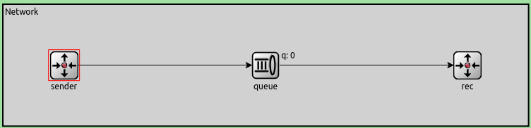

# Control de Congestión y Flujo en la Capa de Transporte con OMNET++

> Informe de la tarea de Análisis del laboratorio 3 de Redes y Sistemas Distribuidos (1C 2022)

## Index

- [Control de Congestión y Flujo en la Capa de Transporte con OMNET++](#control-de-congestión-y-flujo-en-la-capa-de-transporte-con-omnet)
  - [Index](#index)
  - [Abstract](#abstract)
- [Análisis de la red sin control de congestión ni flujo](#análisis-de-la-red-sin-control-de-congestión-ni-flujo)
  - [Introducción a la red básica](#introducción-a-la-red-básica)
    - [Introducción a la red con TLCP](#introducción-a-la-red-con-tlcp)
  - [Presentación del Caso I](#presentación-del-caso-i)
  - [Presentación del Caso II](#presentación-del-caso-ii)
  - [Análisis del Caso I](#análisis-del-caso-i)
    - [Hipótesis](#hipótesis)
    - [Mediciones](#mediciones)
    - [Análisis](#análisis)
  - [Análisis Caso II](#análisis-caso-ii)
    - [Hipótesis](#hipótesis-1)
    - [Mediciones](#mediciones-1)
    - [Análisis](#análisis-1)
  - [Conclusión parcial](#conclusión-parcial)
- [Análisis de la red con *TLCP*](#análisis-de-la-red-con-tlcp)
  - [Pantallazo a *Transport Limited Control Protocol*](#pantallazo-a-transport-limited-control-protocol)
  - [Caso I](#caso-i)
    - [Hipótesis](#hipótesis-2)
    - [Mediciones](#mediciones-2)
    - [Análisis](#análisis-2)
  - [Caso II](#caso-ii)
    - [Hipótesis](#hipótesis-3)
    - [Mediciciones](#mediciciones)
    - [Análisis](#análisis-3)
  - [Comparación con la red previa](#comparación-con-la-red-previa)
- [Conclusión](#conclusión)

## Abstract

En este laboratorio se estudió el comportamiento de las redes frente a problemas de congestión y flujo con la herramienta de simulación por eventos discretos *OMNETT++*. Se tomó una red simplificada y se hizo un análisis sobre un escenario con problemas por congestión, otro por problemas de flujo, y luego se estudió la efectividad en ambos casos de nuestra implementación de control de ambos problemas.

# Análisis de la red sin control de congestión ni flujo

## Introducción a la red básica

La red simplificada tiene un `sender` y un `receiver`, y un nodo intermedio `queue` que simboliza la subred entre el transmisor y receptor.

El emisor genera paquetes de *12500 bytes* bajo una distribucción exponencial centrada en un tiempo **`T`** y tanto la `queue` intermedia como el receptor tienen un buffer interno para manejar paquetes entrantes.

El receptor tiene un *datarate* interno para su `Sink`. El Sink modela lo que sería la capa de aplicación del lado del receptor, y este datarate existe para simular problemas de flujo propios del receptor.

Por razones de conveniencia con respecto a la segunda parte de este análisis, se modificó la simulación original en los siguientes aspectos:

 * El tamaño del buffer del nodo intermedio `queue` se cambio de **200** a **100** paquetes.
    > Esto para facilitar las mediciones del control de congestión.
 * El largo de la simulación se aumentó de **200 segundos** a **300 segundos**
    > Esto para normalizar aun más los datos estadísticos provenientes de la generación azarosa de paquetes.

### Introducción a la red con TLCP

La implementación de nuestro algoritmo requiere un canal de vuelta entre el receptor y emisor, por lo que se agregó ese canal con las mismas características (`datarate` y `delay`) del **nodo intermedio**. También en cada caso los parámetros de los enlaces de envío al receptor son los mismos que en la red básica para que sus mediciones sean comparables.

## Presentación del Caso I

| Conexión                           | Datarase      |
| ---------------------------------- | ------------- |
| entre `TransRx` y `RecAppLayer`    | **`0.5Mbps`** |
| entre `emisor` y `nodo intermedio` | **`1.0Mbps`** |

## Presentación del Caso II

| Conexión                           | Datarase      |
| ---------------------------------- | ------------- |
| entre `TransRx` y `RecAppLayer`    | **`1.0Mbps`** |
| entre `emisor` y `nodo intermedio` | **`0.5Mbps`** |

---
> `TransRx` : Capa de transporte del Receptor
>
> `RecAppLayer`: Capa de aplicación del receptor

---

## Análisis del Caso I

### Hipótesis

Con esos datos podemos ver a simple vista que existe un **cuello de botella** entre las dos capas de aplicación que se encuentra en el receptor mismo.

El *receptor* va a recibir mensajes más rápidos de lo que puede procesarlos, eventualmente generando **droppeos** de paquetes.

Esto es un ejemplo de problemas de *flujo*.

### Mediciones

Primero se tomó un intervalo de generación relativamente grande (**`T = 2s`**). Si bien el análisis teórico del problema dice que el receptor tiene un problema de flujo, si se ocupa poco la red no debería haber pédida de paquetes o una mínima pérdida.

| Itv   | Gen  | Del  | Drop Q | Drop R | AvDel [s] |
|-------|------|------|--------|--------|-----------|
| 2.0   | 144  | 144  | 0      | 0      | 0.40      |
| 0.8   | 367  | 367  | 0      | 0      | 0.43      |
| 0.4   | 754  | 754  | 0      | 0      | 0.49      |
| 0.3   | 989  | 989  | 0      | 0      | 0.58      |
| 0.25  | 1190 | 1187 | 0      | 0      | 0.72      |
| 0.23  | 1280 | 1279 | 0      | 0      | 0.94      |
| 0.22  | 1344 | 1344 | 0      | 0      | 1.11      |
| 0.21  | 1418 | 1401 | 0      | 0      | 1.49      |
| 0.2   | 1494 | 1469 | 0      | 0      | 2.41      |
| 0.18  | 1664 | 1494 | 0      | 0      | 14.52     |
| 0.175 | 1710 | 1496 | 0      | 15     | 18.07     |
| 0.17  | 1763 | 1497 | 0      | 65     | 21.54     |
| 0.16  | 1867 | 1497 | 0      | 166    | 26.45     |
| 0.15  | 1979 | 1498 | 0      | 278    | 29.16     |
| 0.14  | 2136 | 1498 | 0      | 438    | 30.99     |
| 0.1   | 2933 | 1498 | 0      | 1231   | 35.83     |

> **Referencia**
>
> *Itv:* Intervalo de Generación
>
> *Gen:* Paquetes Generados
>
> *Del:* Paquetes entregados
>
> *Drop:* Paquetes perdidos **en la cola intermedia**
>
> *AvDel:* Retraso de entrega promedio

###

### Análisis

* Se puede notar que hasta el rango de aproximadamente 0.25 de intervalo la red no tiene ningún tipo de retraso. Las colas están prácticamente todo el tiempo vacías
* Luego de eso hasta el rango 0.18 las colas comienzan a llenarse pero todavía no se pierden paquetes. El problema comienza a vislumbrarse, lo cual se manifiesta en que retraso promedio que suba en 2 órdenes de magnitud (de 0.4 -> 14.52).
* De ahí en más aumentar la generación de paquetes finalmente genera la pérdida de los mismos y no solamente un aumento del retraso.
* Se puede notar que la carga efectiva que de ahi en más el receptor puede recibir es de 1498 y se mantiene ahí.

Con estos datos: Se realizaron los siguientes grafos

---

## Análisis Caso II

### Hipótesis

En este caso se percibe que la velocidad de generación es más rápida que la velocidad de las cola en recibir y enviar al paquete al sink.

De esta manera la cola paulativamente se llenará y empezará a dropear paquetes.

Este es un claro problema de congestión, la interred no puede manejar la velocidad del generador y al no haber caminos alternativos siempre habrá problemas de congestión.

### Mediciones

| Itv   | Gen  | Del  | Drop Q | Drop R | AvDel [s] |
|-------|------|------|--------|--------|-----------|
| 2.0   | 144  | 144  | 0      | 0      | 0.40      |
| 0.8   | 367  | 367  | 0      | 0      | 0.43      |
| 0.4   | 754  | 754  | 0      | 0      | 0.49      |
| 0.3   | 989  | 989  | 0      | 0      | 0.58      |
| 0.25  | 1190 | 1187 | 0      | 0      | 0.72      |
| 0.23  | 1280 | 1279 | 0      | 0      | 0.94      |
| 0.22  | 1344 | 1334 | 0      | 0      | 1.11      |
| 0.21  | 1418 | 1401 | 0      | 0      | 1.49      |
| 0.2   | 1494 | 1469 | 0      | 0      | 2.41      |
| 0.18  | 1664 | 1494 | 67     | 0      | 13.25     |
| 0.175 | 1710 | 1496 | 115    | 0      | 14.41     |
| 0.17  | 1763 | 1497 | 165    | 0      | 15.25     |
| 0.16  | 1867 | 1497 | 266    | 0      | 16.59     |
| 0.15  | 1979 | 1498 | 379    | 0      | 17.40     |
| 0.14  | 2136 | 1498 | 538    | 0      | 17.96     |
| 0.1   | 2933 | 1498 | 1332   | 0      | 19.98     |

###

### Análisis

Comparando con el caso 1 vemos 2 cambios significativos:
* **Capa de receiver**: En este caso no hay dropeo en la cola del receptor debido a que el datarate es el doble de rápido y por este mismo motivo el delay baja.
* **Drop Q**: En este caso el datarate entre la cola intermedia y la capa del deceptor se divide a la mitad (de 1Mbps a 0.5Mbps), se mantiene el datarate del generador con la cola intermedia (1Mbps) lo que provoca el llenado de la cola intermedia, generando paquetes dropeados.

## Conclusión parcial

/* TODO */

----
# Análisis de la red con *TLCP*
> **TLCP** : **Trasport *Limited* Control Protocol**

## Pantallazo a *Transport Limited Control Protocol*

TLCP implementa *Control de Flujo* y *Control de Congestion*, con un receptor manteniendo un feedback constante al emisor mediante paquetes de confirmacion (ACK).

El tamaño del header de cada paquete, llamado `Volt`, tiene tan solo **9** bytes, lo cual agrega muy poco overhead a cada paquetess.

Para una explicación de las especificaciones e implementación de TLCP referirse a [**DISEÑO**](Design.md)

Los detalles de la simulación son identicos para cada caso de la red anterior sin control de flujo ni control, por lo que saltaremos directamente al análisis

## Caso I

/* TODO */

### Hipótesis

/* TODO */

### Mediciones

/* TODO */

Caso I Tabla

| Itv   | Gen  | Del  | Drop Q | Drop R | AvDel [s] | RTT |
|-------|------|------|--------|--------|-----------|-----|
| 2.0   | 144  | 144  | 0      | 0      | 0.40      | 0.2 |
| 0.8   | 367  | 367  | 0      | 0      | 0.43      | 0.2 |
| 0.4   | 754  | 754  | 0      | 0      | 0.49      | 0.2 |
| 0.3   | 989  | 989  | 0      | 0      | 0.58      | 0.2 |
| 0.25  | 1190 | 1187 | 0      | 0      | 0.72      | 0.2 |
| 0.23  | 1280 | 1279 | 0      | 0      | 0.94      | 0.2 |
| 0.22  | 1344 | 1334 | 0      | 0      | 1.11      | 0.2 |
| 0.21  | 1418 | 1401 | 0      | 0      | 1.49      | 0.2 |
| 0.2   | 1494 | 1469 | 0      | 0      | 2.41      | 0.2 |
| 0.18  | 1664 | 1494 | 0      | 0      | 14.52     | 0.2 |
| 0.175 | 1710 | 1496 | 0      | 0      | 18.07     | 0.2 |
| 0.17  | 1763 | 1497 | 0      | 0      | 21.68     | 0.2 |
| 0.16  | 1867 | 1497 | 0      | 0      | 29.15     | 0.2 |
| 0.15  | 1979 | 1498 | 0      | 0      | 36.64     | 0.2 |
| 0.14  | 2136 | 1498 | 0      | 0      | 44.17     | 0.2 |
| 0.1   | 2933 | 1498 | 0      | 0      | 74.44     | 0.2 |
| 0.05  | 5847 | 1498 | 0      | 0      | 112.24    | 0.2 |

### Análisis

/* TODO */

## Caso II

/* TODO */

### Hipótesis

/* TODO */

### Mediciciones

/* TODO */

### Análisis

/* TODO */

## Comparación con la red previa

/* TODO */

# Conclusión

/* TODO */
