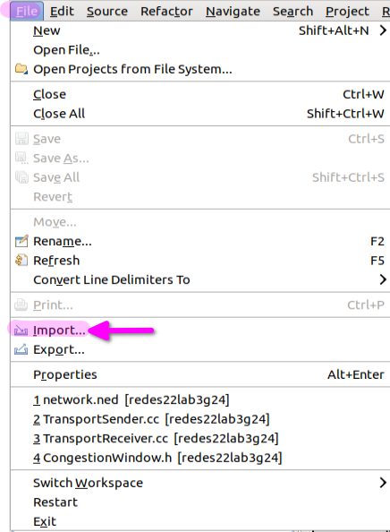

# Laboratorio N°3: Capa de Transporte

Redes y Sistemas Distribuidos - Primer cuatrimestre, FAMAF - 2022.

> Redes y Sistemas Distribuidos 2022 - FAMaF, UNC.

# Integrantes
- Carrizo, Ernesto.
- Domínguez, Agustín.
- Vispo, Valentina.

---

**[ENUNCIADO](Enunciado.md) | [ANÁLISIS](Analysis.md) | [DISEÑO](Design.md)**

---

# Objetivos

- Leer, comprender y generar modelos de red en Omnet++.
- Analizar tráfico de red bajo tasas de datos acotadas y tamaño de buffers limitados.
- Diseñar y proponer soluciones de control de congestión y flujo.


FIXTHIS
1. ¿Cómo cree que se comporta su algoritmo de control de flujo y congestión ? ¿Funciona para el caso de estudio 1 y 2 por igual? ¿Por qué?

# Primer Diseño

- [x] Mensajes para ambos tipos de mensajes (datos y acks).
- [/] Parada y espera. *(Descartado)*
- [x] N° de seq.
- [x] ACK flag.
- [x] BufferSize.
- [x] Ventana de congestión v1.

# Segundo diseño

- [x] Ventana corrediza.
- [ ] Ventana de congestión v2.
- [x] Arranque lento.
- [/] Threshold. *(Descartado)*
- [ ] Retransmisión.
- [ ] Arranque lento al inicio y luego recuperación rápido.
- [x] Timer -> Timeout.

# Tercer diseño

- [ ] Control de flujo.

# Modificaciones

La ventana de congestión mide su disponibilidad en cantidad de bytes (no en cantidad de segmentos).

> .ini


Network.sender.senderAppLayer.packetByteSize = 12500

** nos dice que forma parte de todos como "global"
Network.**.packetByteSize = 12500

Reno Controller

- ~umbral~
- packetDropped
- stage

Congestion Window
- Que el emisor sepa distinguir [(state, timer), etc , ]

- seqNumber
- acks

---

# Realizar

Generar el evento rtt cuando se inicializa

Re sched del rtt cuando se recibe

Hacer el schedAt del timeout en la función handleSelfMsg

Arreglar el simtime_t del rtt

Implementar los métodos del CongestionController

# Mejoras posibles

Se asume que la cola del Sender es arbitrariamente grande, por lo que no nos concierne su espacio para las retransmisiones. Sino fuese el caso se podría hacer lo siguiente para reducirlo:
- setear un tamaño fijo en la cola para los paquetes de retransmisión. Este espacio no puede ser ocupado por lo paquetes normales.


# Cómo correrlo

Se necesita la herramienta de simulación discreta **OMNET++**.

## Descarga de Omnet

* [Imagen de Lubuntu con Omnet instalada](https://mega.nz/file/eaJUGIQQ#3h_VvTJlkmK3KHGZPiLd6EubADPxfze2JNRtHfcc3A4)
* [Imagen de docker con Omnet++](https://github.com/mmodenesi/omnetpy)
* [Guia para ejecutar Omnet en Windows](documents/Guia_para_ejecutar_Omnet++_en_Windows.pdf)

### Documentación de OMNet++

* https://doc.omnetpp.org/omnetpp/manual/
* https://stackoverflow.com/questions/52445993/omnet-on-windows-or-linux
* https://stackoverflow.com/questions/7020069/make-library-not-found

## Como importarlo en Omnet

<p align="center">

</p>

<p align="center">

</p>

<p align="center">

</p>

## Correr una simulación

Tenemos un makefile que compila el codigo fuente y lanza la simulación:

## cPacket
https://doc.omnetpp.org/omnetpp/api/classomnetpp_1_1cPacket.html

### Cómo crear class template de packet

1) Crear el archivo `testPacket.msg`

```cpp
packet testPacket
{
     int srcAddress;
     int destAddress;
     int remainingHops = 32;
};
```

2) Correr el comando

```bash
opp_msgc testPacket.msg
```

3) Se habrán generado los archivos `testPacket_m.h` y `testPacket_m.cc`

### Cómo saber de qué gate viene un mensaje

bool arrivedOn()

## 

`cancelEvent()`

---

**[Enunciado.md](Enunciado.md)**
```bash
make clean && make run
```

---

**[ENUNCIADO](Enunciado.md) | [ANÁLISIS](Analysis.md) | [DISEÑO](Design.md)**

---
