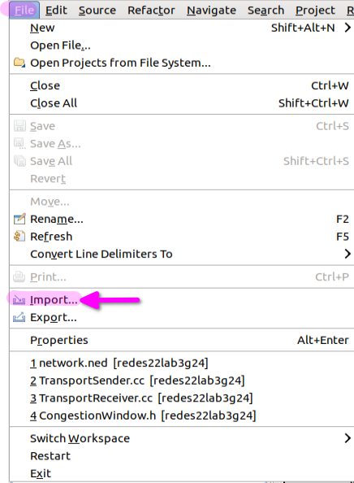
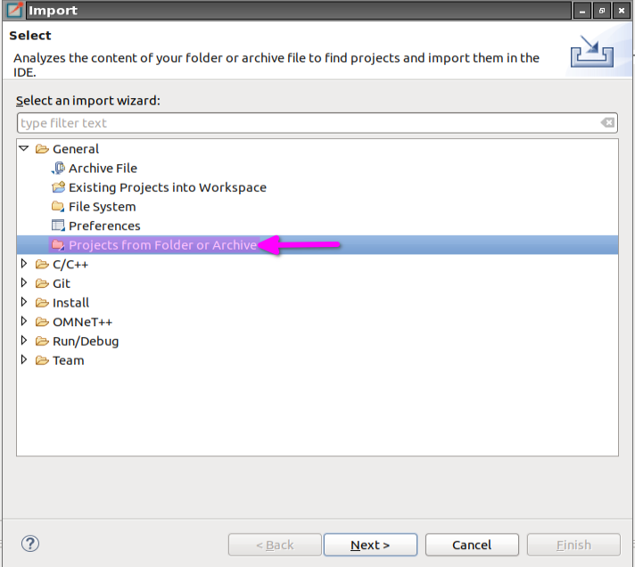
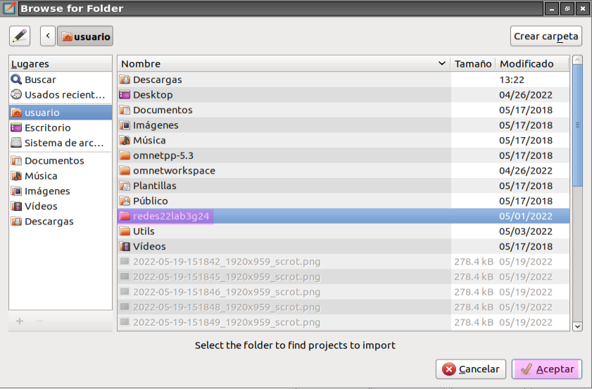
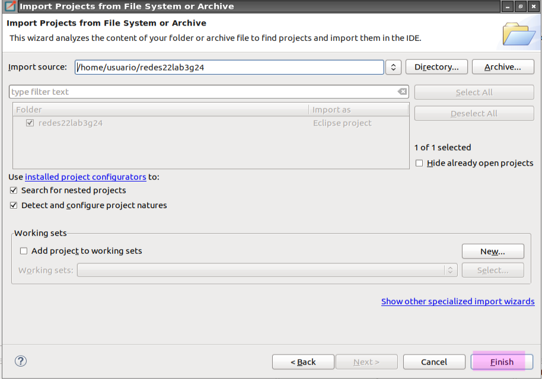
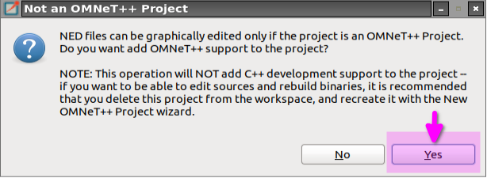

# Laboratorio N°3: Capa de Transporte

Redes y Sistemas Distribuidos - Primer cuatrimestre, FAMaF - 2022.

# Integrantes
- Carrizo, Ernesto.
- Domínguez, Agustín.
- Vispo, Valentina.

---

**[ENUNCIADO](Markdown/Assignment.md) | [ANÁLISIS](Markdown/Analysis.md) | [DISEÑO](Markdown/Design.md)**

---

- [Objetivos](#objetivos)
- [Como correr las simulaciones](#como-correr-las-simulaciones)
  - [Descarga de Omnet](#descarga-de-omnet)
  - [Documentación de OMNet++](#documentación-de-omnet)
  - [Como importar el proyecto en Omnet](#como-importar-el-proyecto-en-omnet)

# Objetivos

- Leer, comprender y generar modelos de red en Omnet++.
- Analizar tráfico de red bajo tasas de datos acotadas y tamaño de buffers limitados.
- Diseñar y proponer soluciones de control de congestión y flujo.


# Como correr las simulaciones

Se necesita la herramienta de simulación discreta **OMNET++**, [¿cómo descargar Omnet?](#descarga-de-omnet)

Luego se debe importar el proyecto. En [esta sección](#como-importar-el-proyecto-en-omnet) está paso a paso cómo hacerlo.


Tenemos un makefile que compila el codigo fuente y lanza la simulación:

```bash
make clean && make run > /dev/null
```

Para crear Volt, EventTimeout, que son clases que heredan de `cPacket` y `cMessage` respectivamente, usamos el comando asistente de Omnet:

```bash
opp_msgc testPacket.msg
```

----
## Descarga de Omnet

* [Imagen de Lubuntu con Omnet instalada](https://mega.nz/file/eaJUGIQQ#3h_VvTJlkmK3KHGZPiLd6EubADPxfze2JNRtHfcc3A4)
* [Imagen de docker con Omnet++](https://github.com/mmodenesi/omnetpy)
* [Guia para ejecutar Omnet en Windows](documents/Guia_para_ejecutar_Omnet++_en_Windows.pdf)

## Documentación de OMNet++

* https://doc.omnetpp.org/omnetpp/manual/
* https://stackoverflow.com/questions/52445993/omnet-on-windows-or-linux
* https://stackoverflow.com/questions/7020069/make-library-not-found

## Como importar el proyecto en Omnet

**File > Import**
<p align="center">

</p>

**General > Projects from Folder or Archive**
<p align="center">

</p>

**Path del repositorio y le damos aceptar**
<p align="center">

</p>

<p align="center">

</p>

**En caso de que nos aparezca un mensaje emergente cuando seleccionamos el archivo `network.ned`, le daremo a YES**
<p align="center">

</p>

# Como generar los gráficos

- [Generar gráfico carga útil vs ofrecida](graphs/how_to_run.md)
- Importar el proyecto de JupyterLab: [graphs/jupyterlab/MyJupyOmnet_v2.ipynb](graphs/jupyterlab/MyJupyOmnet_v2.ipynb)

---

**[ENUNCIADO](Markdown/Assignment.md) | [ANÁLISIS](Markdown/Analysis.md) | [DISEÑO](Markdown/Design.md)**

---
